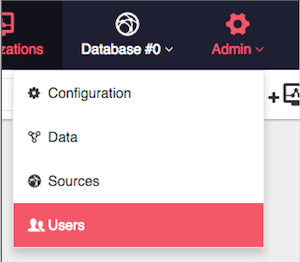
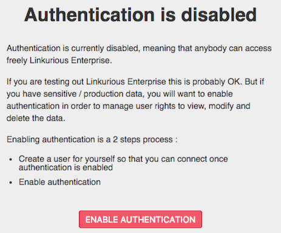
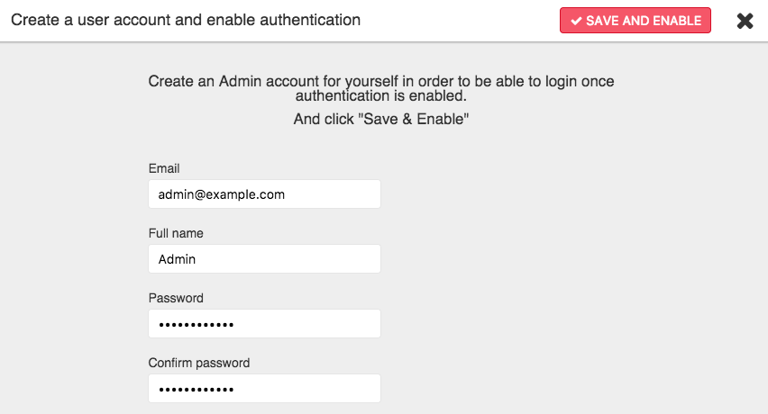

> We strongly advise you to enable user authentication to secure the 
access to your data once {{lke}} is deployed on a server. 
This will allow you to enforce the limit of authenticated users with 
regards to your license terms.

By default, user authentication is disabled and all actions are 
performed under the special account named `"Unique User"`. 
The unique user has unrestricted access and does not require a
password, so anyone can access the platform. 

To enable authentication use the Web user interface via the *Admin* > *Users* menu:

The following screen will be prompted if authentication is disabled. Click *Enable Authentication*.

Create an admin account and click *Save and enable*.

