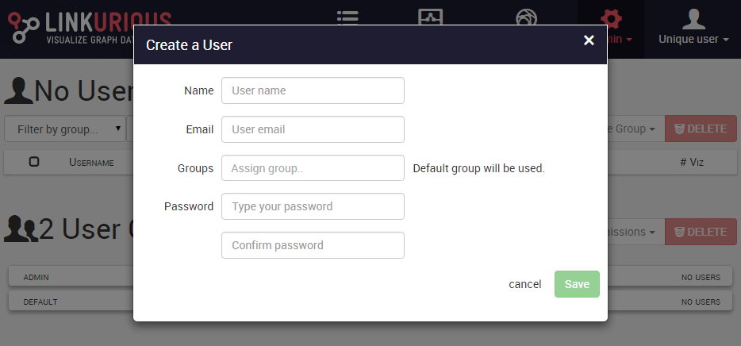
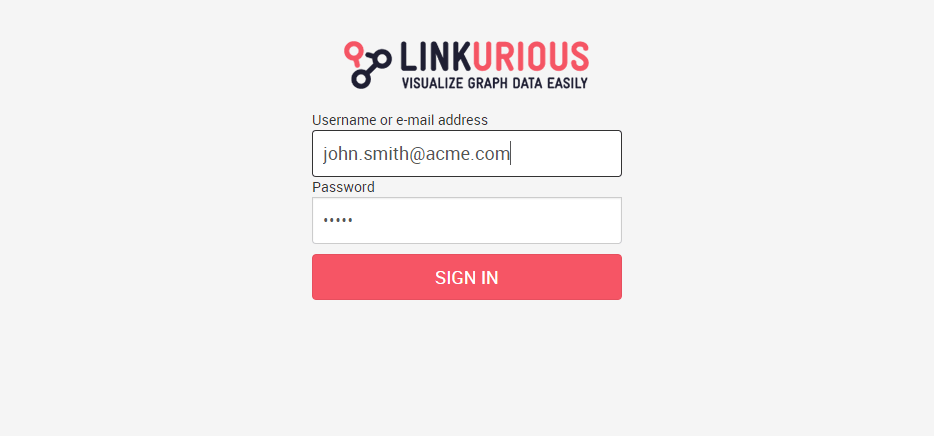

> We strongly advise you to enable user authentication to secure the 
access to your data once {{lke}} is deployed on a server. 
This will allow you to enforce the limit of authenticated users with 
regards to your license terms.

By default, user authentication is disabled and all actions are 
performed under the special account named `"Unique User"`. 
The unique user has unrestricted access and does not require a
password, so anyone can access the platform. 

Before enabling user authentication we must create an administrator
account.

> You need to create an administrator account before enabling 
authentication, otherwise you will not be able to log in.

Let's create an administrator account. 
Select the *Users* from the *Admin* menu of the navigation bar. 
Once the user management dashboard is displayed, click on the *Add*
button next to `"No Users"`. 

The user creation form appears:

 
Fill in all the fields and especially add the `admin` group in the
groups field to grant administration rights to the new user.
When done, click *Save*.

Once you have create the first administrator, you can enable user
authentication.
Edit the configuration file ({{config}}) and set the `authRequired` key to `true` (see [how to configure access](/access)).
Restart {{lke}}.
User authentication is now enabled. 
Reload the user interface of the Web application to display the login
screen.

