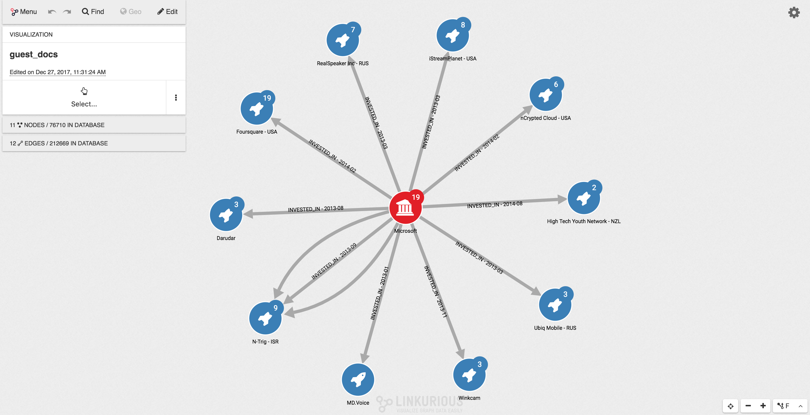
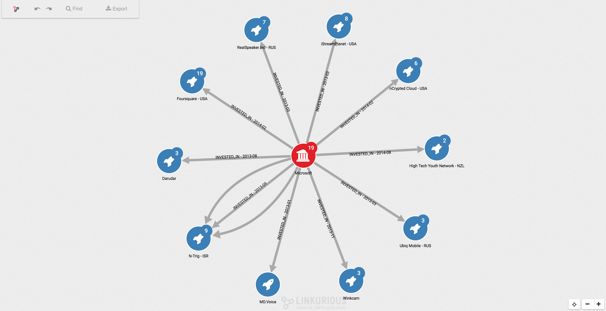

# What is the Guest mode
The Guest mode is a way to share graphs with people who do not have an account on Linkurious Enterprise.

Key characteristics:
- **Embeddable in 3rd-party applications**: the URL provided by the Guest mode can be embedded in an *iframe*.
- **Public link sharing**: if you are an authenticated user you can create and share public links to your visualizations.
- **Read-only**: the data in the database cannot be altered by a Guest user.
- **Simplified interface**.

Standard user interface:

Guest mode user interface:

# Enabling the Guest mode
By default, the Guest mode is disabled. Enabling the Guest mode is done on a per-source basis so that you can manage the access rights associated with the Guest mode at the source level.

Enabling it is a 3-steps process:
1. In the Configuration screen (Menu > Admin > Configuration) activate the Guest mode
2. A new user is created in the [user list](/users/#creating-users) with the email `guest@linkurio.us`. By default it is not associated with any user group. [Assign the Guest user](/users/#assigning-users-to-groups) to the Read-Only group, or any custom group if you need to restrict its rights (see the security warnings below).
3. Repeat step 2 for each source on which you want to enable the Guest mode as its access rights are managed on a source per source basis.

Once enabled, the Guest mode is available at **http://\<linkurious\>/guest** (replace `<linkurious>` with the actual host and port of your server).

# Security warnings
All people who have access to `/guest` will be able to browse the whole database (in read-only mode), even if nobody has explicitly shared a specific visualization with them. You may want to check who has access to `/guest` before enabling the Guest mode.

If you have assigned the Guest user to the Read Only built-in user group, all node categories and edge types will be available to see by the people who can access `/guest`. If the database contains sensitive data, you should [create a custom group](/users/#create-a-custom-group) with limited rights on the data and assign the Guest user to that group.

Even if the Guest user is assigned to a group that has Write or Delete permissions, Guest mode users will not be able to write or edit data.

> When initialized with a visualization, the Guest mode allows the user to expand the graph beyond the content of that visualization. Consider restricting the Guest user access rights if that is an issue.

# Populating the Guest mode workspace
Accessing `/guest` directly will return an empty workspace.

Using parameters in the URL you can populate the Guest mode workspace with:
 - The content of a visualization, using its visualization ID: `/guest?populate=visualizationId&item_id=123`
 - A node, using its node ID: `/guest?populate=nodeId&item_id=123`
 - A node and its neighbours, using its node ID: `/guest?populate=expandNodeId&item_id=123`
 - A search query: `/guest?populate=searchNodes&search_query=paris&search_fuzziness=0.8`
 - A pattern query (e.g. a [Cypher query](https://neo4j.com/developer/cypher-query-language/)): `/guest?populate=pattern&pattern_dialect=cypher&pattern_query=MATCH+(n1)-%5Be%5D-(n2)+WHERE+ID(n1)%3D10+RETURN+e`

> The Guest user sees the current state of a visualization. Any change to a visualization from an authenticated user will be automatically applied to the public link shared to the Guest user.
