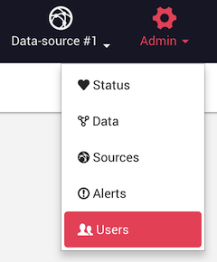

Linkurious relies on a [role-based access control](https://en.wikipedia.org/wiki/Role-based_access_control)
model based on *node-categories* and *edge-types*:

- *Users* belong to at least one *user-group*
- *User-groups* have several *access-rights*
- Each *access-right* defines access to a specific *node-category* or *edge-type*:
   - `none` (no access)
   - `read` (read-only access)
   - `write` (read and write access)

When users belong to several user-groups, it can happen that many access-rights are defined for a 
node-category (or edge-type). In this case, the more permissive access-right is granted.

## Example

- User `Foo` belong to User-groups `Accounting` and `Sales`
- User-group `Accounting` has:
   - READ access to node-category `COMPANY`
   - WRITE access to node-category `CONTRACT`
- User-group `Sales` has:
   - READ access to node-category `CONTRACT`
   - WRITE access to node-category `CUSTOMER`
- **Result**:
   - User `Foo` has READ access to node-category `COMPANY` (via User-group `Accounting`)
   - User `Foo` has WRITE access to node-category `CONTRACT`  (via User-group `Accounting`)
   - User `Foo` has WRITE access to node-category `CUSTOMER`  (via User-group `Sales`)

## Creating users, groups and rights

To create users, user-groups and access-rights, administrators can use the Web user interface
via the *Admin* > *Users* menu:

## Password hashing

Passwords are hashed with the 
[PBKDF2 algorithm](https://en.wikipedia.org/wiki/PBKDF2) and the following parameters:

- iterations: 1000
- salt length: 96 bits
- key length: 256 bytes

## External users

When using an external source for authentication (LDAP, Active Directory, OpenID Connect etc.),
users are automatically created in Linkurious when they first connect.

These shadow-users allow to store Linkurious specific data such as user preferences, user-groups and other objects (visualizations, etc.).
Passwords of external users are never stored inside Linkurious.

The user-group that will be attributed to these users is the `default` user-group (with read-all access),
unless you specify a group ID in `access.externalUserDefaultGroupId` or you configure a group mapping.
(see details on [how to configure access](/access)).

### Group mapping

{{access.groupmapping}}

To exclude some groups of users from logging in into Linkurious, set up a list of 
authorized groups in the configuration key `access.externalUsersAllowedGroups`.
