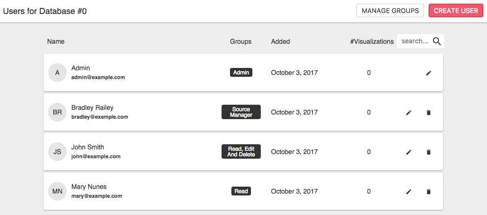
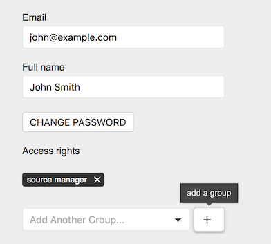
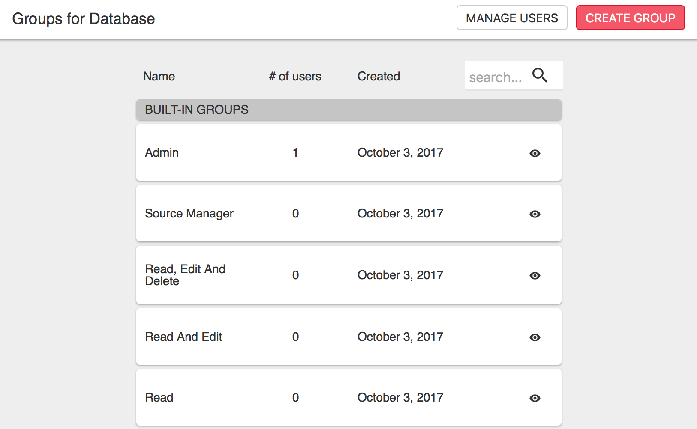
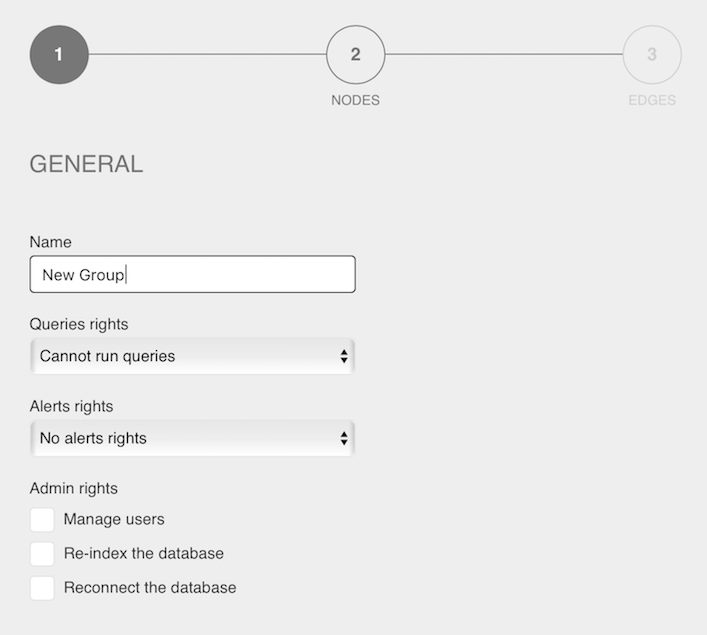
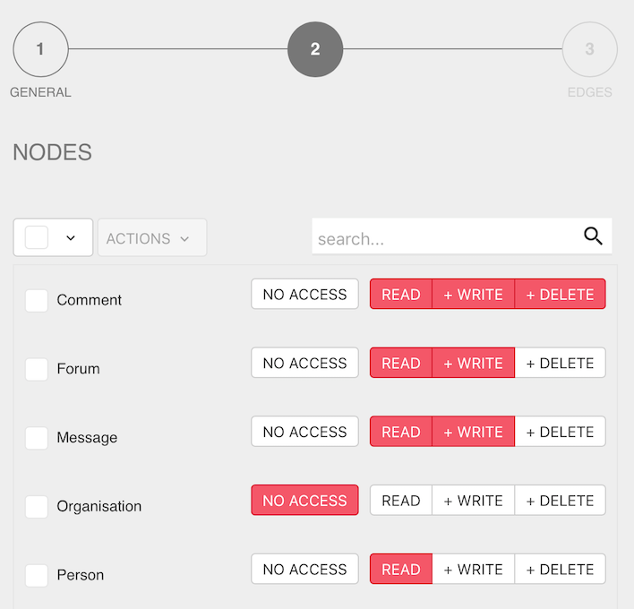

Linkurious relies on a [role-based access control](https://en.wikipedia.org/wiki/Role-based_access_control)
model based on *node-categories* and *edge-types*:

- Every *user* belongs to at least one *built-in group* per data-source
- Every *group* belongs to a data-source and has several *access-rights* on it
- Each *access-right* defines access to a specific *node-category* or *edge-type*
- The followings are the possible access-rights:
   - `no access`: The user can't see the node/edge with this category/type
   - `read`: The user can see it
   - `write`: The user can edit it
   - `delete`: The user can delete it

When users belong to several groups, it can happen that many access-rights are defined for a 
node-category (or edge-type). In this case, the more permissive access-right is granted.

## Access-right example

- User `Foo` belong to the groups `Accounting` and `Sales`
- Group `Accounting` has:
   - READ access to node-category `COMPANY`
   - WRITE access to node-category `CONTRACT`
- Group `Sales` has:
   - READ access to node-category `CONTRACT`
   - WRITE access to node-category `CUSTOMER`
- As a result:
   - User `Foo` has READ access to node-category `COMPANY` (via group `Accounting`)
   - User `Foo` has WRITE access to node-category `CONTRACT` (via group `Accounting`)
   - User `Foo` has WRITE access to node-category `CUSTOMER` (via group `Sales`)

## Creating users

Only when authentication is enabled, use the Web user interface via the *Admin* > *Users* menu:

From this page, you can see all the users in Linkurious (both local and [external](/access/#local-vs-external-authentication) users)
and their groups *in the current data-source*:

To create a new user, click *Create User*.

## Assigning users to groups

Click *edit* button next to a user. The following screen will appear:

Any user can belong to at most 1 built-in group, no limitations occurs for custom groups.
Click *+* to add a new group to the user.

> Any user can't edit its own groups.

## Built-in groups

Linkurious defines several built-in groups.
To learn more about them, click the *inspect* button next to a built-in group.

To create a new group, click *Create Group*.

## Create a custom group

Define a name for the custom group.
You can hover on the options to learn more about them.

On the next page, you can select the *access-right* for any given node-category:

## Password hashing

Passwords of local users are hashed with the 
[PBKDF2 algorithm](https://en.wikipedia.org/wiki/PBKDF2) and the following parameters:

- iterations: 1000
- salt length: 96 bits
- key length: 256 bytes

## External users

When using an external source for authentication,
users are automatically created in Linkurious when they connect for the first time.

These shadow-users allow to store Linkurious specific data such as user preferences,
groups and visualizations.

> Passwords of external users are never stored inside Linkurious.

### Group mapping

{{access.groupmapping}}
