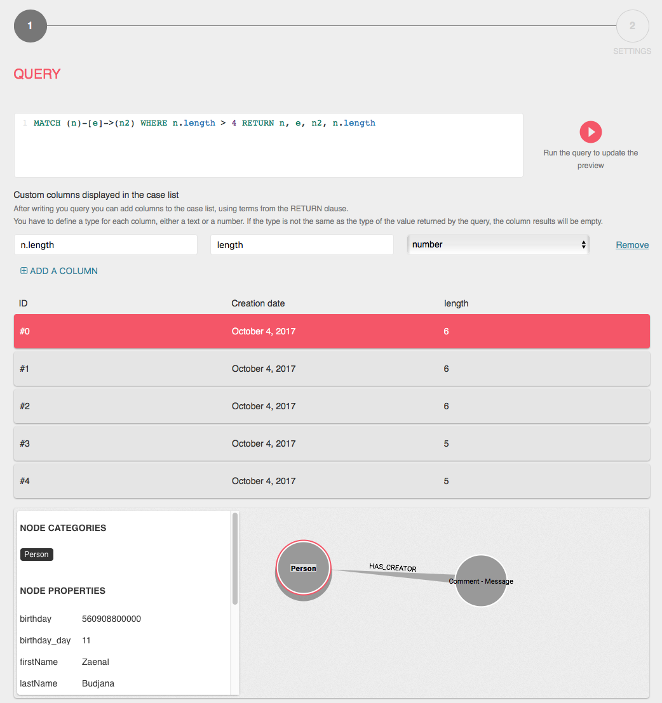
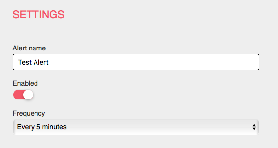
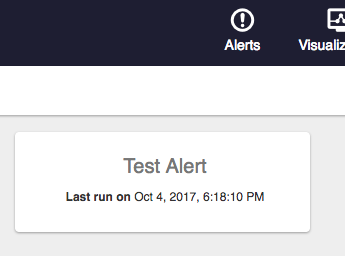
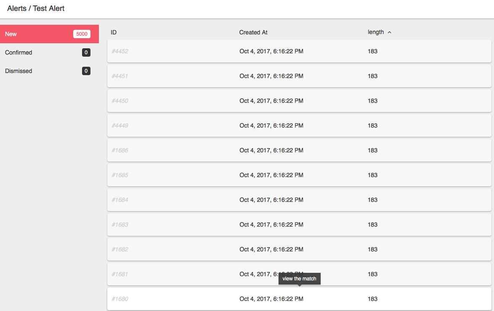
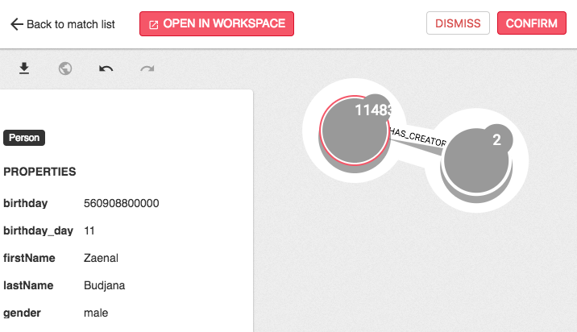

Alerts are a way to watch your graph database for specific patterns and be notified
when such pattern appears in the data. 
A simple triage interface let the users navigate through pattern matches and flag
them as *confirmed* or *dismissed*.

> Alerts are a supported only for Neo4j in Linkurious {{package.version}}.

If you are interested in alerts from other graph vendors, please [get in touch](/support).

## How alerts work

To create an alert, an administrator needs to:
- Write a graph pattern query (e.g. a [Cypher query](https://neo4j.com/developer/cypher-query-language/) in the case of Neo4j)
- Configure additional columns to be returned along each match

Using the *Run query* button, you can preview results for the current query:

> Additional columns can be configured using explicitly returned values, as done here with *n.length*.

Clicking *Next*, a secondary configuration page will ask for the name of the alert and the *frequency*
at which the query will be run.

After configuring and enabling an alert, it can eb accessed by users in the *Alerts* panel:

Opening an alerts lists all recent matches, sortable by any column:

Clicking on a match opens it for details:

<!-- todo: please check that none of the images you use are wider than 900px -->
<!-- todo: don't use retina-enabled images, they will appear twice as big on non-retina screens -->
