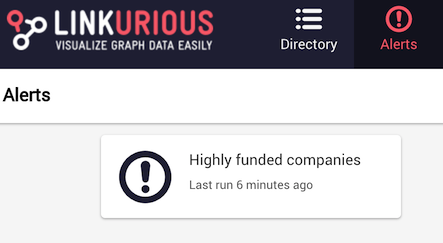
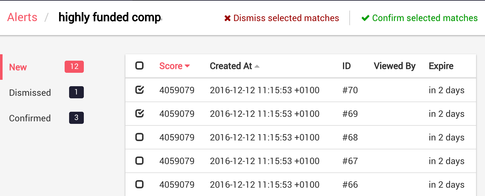
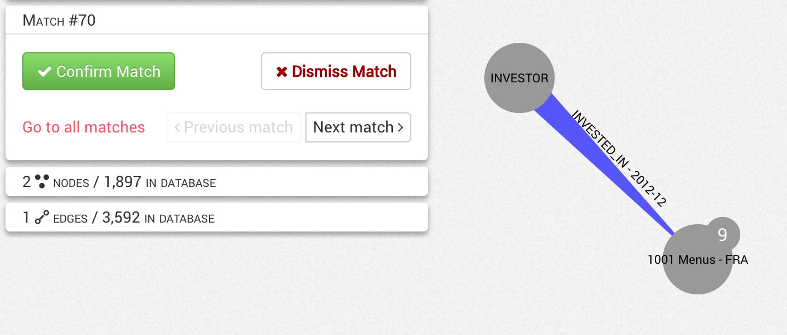

Alerts are a way to watch your graph database for specific pattens and be notified
when such a pattern appears in the data. 
A simple classification interface lets users navigate through pattern matches and flag
them as *confirmed* or *dismissed*.

## How alerts work

To create an alert, an administrator needs to:
- Write a graph pattern query (e.g. a [Cypher query](https://neo4j.com/developer/cypher-query-language/) in the case of Neo4j)
- Choose how often this query is going to be run (e.g. every 15 minutes)
- Configure an optional score column from the Pattern query results, to sort matches

After that, users will have access to all matches to this alert in the *Alerts* panel of Linkurious:

Opening an alerts lists all recent matches sorted by score:

Clinking on a match opens it in graph view for details:

