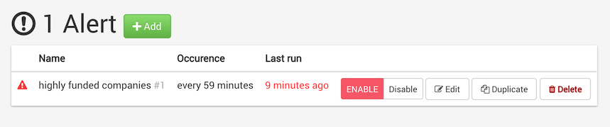

Alerts are currently only supported on Neo4j databases.

## Creating a new alert

To create an Alert, open the *Admin* > *Alerts* menu and click *add*:


Alert settings are:

- **Name**: A nome for the alert your are creating (e.g. highly funded french companies)
- **Query**: A graph pattern query. e.g.:
   ```sql
   MATCH (company:COMPANY)<-[investment:INVESTED_IN]-(investor)
   WITH
     sum(investment.raised_amount_usd) as totalRaisedAmount,
     collect(investor) as investors,
     collect(investment) as investments,
     company
   WHERE totalRaisedAmount > 10000000
   RETURN company, investments, investors, totalRaisedAmount
   ```
  This query will match all companies that have raised more than $10'000'000 and
  return a match for each company with all its investors.
- **Score column** Result column that will be used to sort results 
   (e.g. `totalRaisedAmount` to sort companies by the total raised amount)
- **Sort direction** (e.g. Descending to show highly funded companies first)
- **Frequency**: Frequency at which the query will be re-run to refresh matches (e.g. Hourly, every 5 hours)
- **Match TTL** (default: `30` days): The time to live of a match in days, i.e. how long a non-confirmed match is kept before being deleted (e.g. 1 day)
- **Maximum matches** (default: `5000` matches): The maximum number of matches to keep for a given alert (e.g. 5'000 matches)
- **Maximum runtime** (default: `600000` ms, 10 minutes): The maximum runtime of the alert query, in milliseconds (e.g. 60'000 milliseconds)

When done, click *Save and enable* to run the query right away.

## Disabling an alert

If you want to prevent an alert from running and hide it from users,
you can disabled it from the administrator user interface (*Disable* button on each alert).

Keep in mind that *deleting* an alert will delete all it existing matches.
