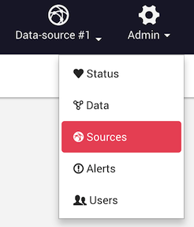

When you save a visualization in Linkurious, only the node and edge *identifier* are persisted in the user-data store,
along with position and style information.
When a visualization is loaded, the node and edge *identifiers* are used to reload the actual node and edge data from the graph database.

If you need to re-generate your graph database from scratch,
the graph database will probably generate new *identifiers* for all nodes and edges,
breaking all references to nodes and edges in existing visualizations.

## Using a property as a stable identifier

You can configure Linkurious to use a node or edge property as *stable identifiers*.
Once set-up, Linkurious will use the given property as identifier instead of using the identifiers generated by the database.

Thank to this strategy, visualizations will be robust to graph re-generation.

Notice that the properties used as identifier should be indexed by the database to allow for a fast lookup by value.

## Alternative identifiers configuration

To use alternative node and edge identifiers,
edit your data-source database configuration in the configuration file ({{config}}):

Example of alternative identifier configuration with Neo4j:
```json
{
  "dataSources": [
    {
      "graphdb": {
        "vendor": "neo4j",
        "url": "http://127.0.0.1:7474/",
        "alternativeNodeId": "STABLE_NODE_PROPETY_NAME",
        "alternativeEdgeId": "STABLE_EDGE_PROPETY_NAME"
      }
      // [...]
    }
  ]
}
```

## Stable `sourceKey` in Neo4j

Linkurious generates a unique identifier for data-source, based on internal information from the data-source.
This data-source identifiers (called the `sourceKey`) is used identify all user-data (visualizations etc.)
that belongs to a data-source.

When re-generating a Neo4j graph database, the `sourceKey` will change.
In order to avoid breaking all references to existing visualisations, 
it is possible to manually the `sourceKey` of a data-source.

Before re-generating the graph database, go to the *Admin* > *Sources* menu:


In the sources administration panel, find the **Key** value for your data-source (e.g. `1c3490bd`) and copy it.
 
Then, edit the configuration file ({{config.file}}) 
and set `manualSourceKey` for yur data-source:
```json
{
  "dataSources": [
    {
      "manualSourceKey": "1c3490bd",
      "graphdb": {
        "vendor": "neo4j",
        "url": "http://127.0.0.1:7474/"
      }
      // [...]
    }
  ]
}
```

