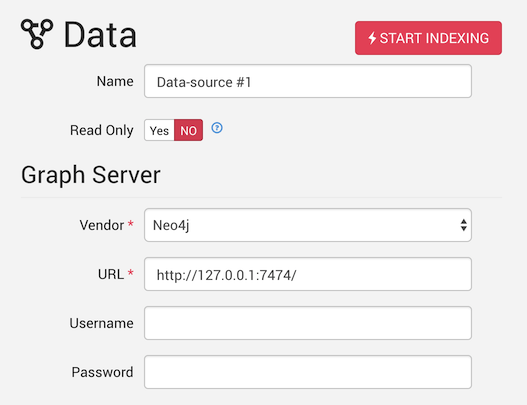

By default, Linkurious is configured to connect to a Neo4j database at `127.0.0.1:7474`.

There are [several ways to edit data-source configuration](#edit-the-data-source-configuration)
if you need to change the default configuration, or if you want to add an additional data-source.

## Supported vendors

Linkurious can connect to some of the the most popular graph databases:
{{entry.menu}}

## Multi-database support

Linkurious is able to connect to several graph databases at the same time
and lets you switch from one database to another seamlessly.

## Edit the data-source configuration

### Using the Web user interface

Using an administrator account, access the *Admin* > *Data* menu to edit the current data-source configuration:

Edit the data-source configuration to match your graph database

Submit the changes by hitting the *Save configuration* button

### Using the configuration file

Edit the configuration file located at `linkurious/data/config/{{config.file}}`.

See details for each supported graph database vendor:
{{entry.menu}}
