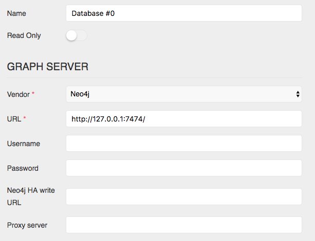

By default, Linkurious is configured to connect to a Neo4j database at `127.0.0.1:7474`.

## Supported vendors

Linkurious can connect to some of the the most popular graph databases:
{{graph.vendor.menu}}

## Multi-database support

Linkurious is able to connect to several graph databases at the same time
and lets you switch from one database to another seamlessly.

## Edit the data-source configuration

You can configure your data-sources via the Web user interface
or directly on the {{config}} file.

### Using the Web user interface

Using an administrator account, access the *Admin* > *Data* menu to edit the current data-source configuration:

Edit the data-source configuration to connect to your graph database:

Submit the changes by hitting the *Save configuration* button.

### Using the configuration file

Edit the configuration file located at {{config}}.

See details for each supported graph database vendor:
{{graph.vendor.menu}}
