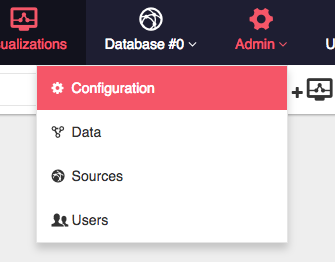
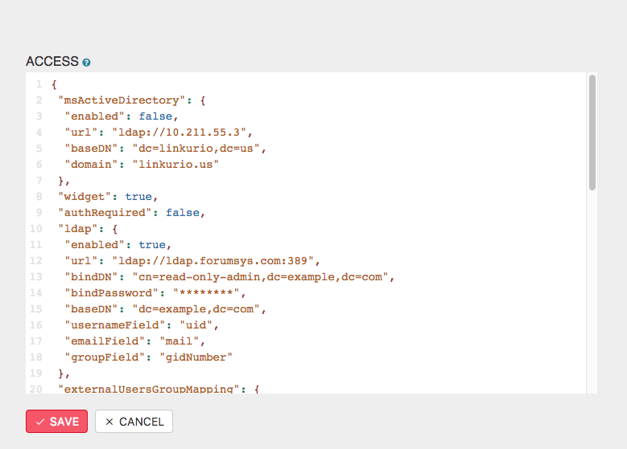

To edit the Linkurious configuration, you can either edit the configuration file located at {{config}}
or use the Web user-interface:

Using an administrator account, access the *Admin* > *Configuration* menu to edit the Linkurious configuration:

> Some configuration keys requires a restart to be applied. Linkurious will notify you about it and offer you to restart from the Web UI **only if** you made the changes from the Web UI itself. If you modified the {{config.file}} file manually, changes won't get applied and you will need to restart Linkurious.

Configuration keys are divided per category. Edit what you need to change and click *Save*.

> Password field will always be hidden from the Web UI, but they can be edited.
