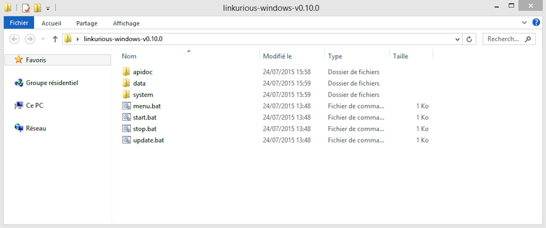
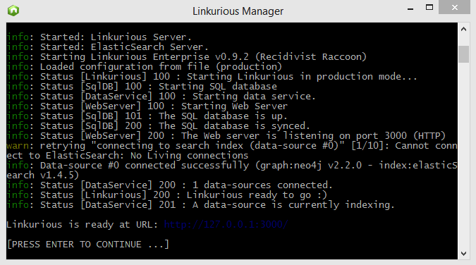

# Linux systems

## Starting

To start Linkurious, run the `start.sh` script in the `linkurious-linux` directory.

Alternatively, run the `menu.sh` script and select *Start Linkurious processes* from the console. 

By default, Linkurious server will listen for connection on port `3000`.
However, some firewalls block network traffic ports other than `80` (HTTP).
See [the Web server configuration documentation](/web-server) to learn how to make Linkurious listen on port `80`.

## Stopping

Run the `stop.sh` script in the `linkurious-linux` directory.

Alternately, run `menu.sh` and select *Stop Linkurious processes* from the console.

# Windows systems

## Starting

To start Linkurious, run the `start.bat` script in the `linkurious-windows` directory.

Alternatively, run the `menu.bat` script and select *Start Linkurious processes* from the console. 

> The firewall of Windows might ask you to authorize connections with Linkurious.
>
> If so, click on Authorize access.

Content of the `linkurious-windows` directory:

Linkurious starting up on Windows:

## Stopping

Run the `stop.bat` script in the `linkurious-windows` directory.

Alternately, run `menu.bat` and select *Stop Linkurious processes* from the console.

# Mac OS X systems

## Starting

To start Linkurious, run the `start.sh.command` script in the `linkurious-osx` directory.

Alternatively, run the `menu.sh.command` script and select *Start Linkurious processes* from the console. 

## Stopping

Run the `stop.sh.command` script in the `linkurious-osx` directory.

Alternately, run `menu.sh.command` and select *Stop Linkurious processes* from the console.

