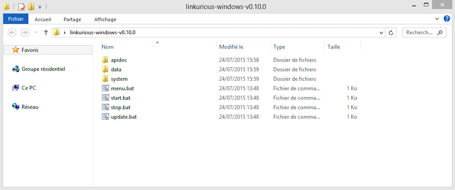
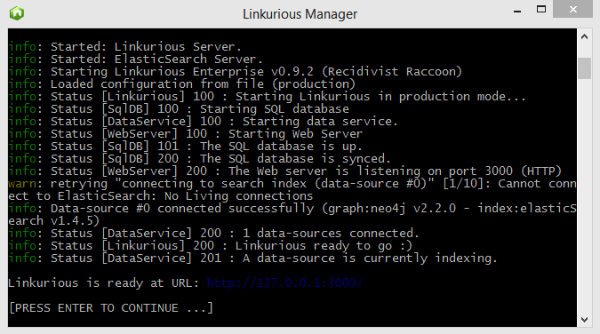

## Linux systems

To start Linkurious, run the `start.sh` script in the `linkurious-linux` directory.

Alternatively, run the `menu.sh` script and click *Start Linkurious*. 

By default, Linkurious server will listen for connection on port `3000`.
However, some firewalls block network traffic ports other than `80` (HTTP).
See [the Web server configuration documentation](/web-server) to learn how to make Linkurious listen on port `80`.

## Windows systems

To start Linkurious, run the `start.bat` script in the `linkurious-windows` directory.

Alternatively, run the `menu.bat` script and click *Start Linkurious*. 

> The firewall of Windows might ask you to authorize connections with Linkurious. If so, click on *Authorize access*.

Content of the `linkurious-windows` directory:

Linkurious starting up on Windows:

## Mac OS X systems

To start Linkurious, run the `start.sh.command` script in the `linkurious-osx` directory.

Alternatively, run the `menu.sh.command` script and click *Start Linkurious*. 
