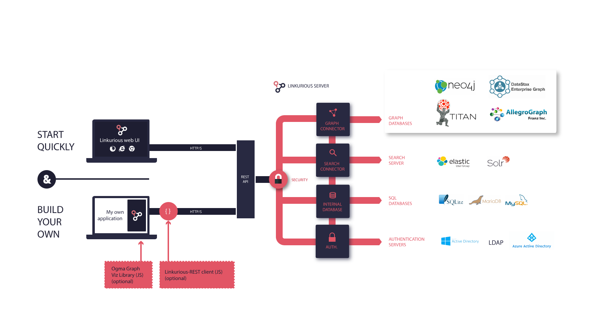

Welcome to the Linkurious administrator documentation. 
This documentation will help you install, run and customize Linkurious.

## Architecture overview

Linkurious is a three-tier application. 
The presentation layer is a Web application. 
It uses our graph visualization library, called Ogma, to allow rich interactions with the graph. 
It also provides a user interface to enable collaboration among end users and data administration.

The presentation layer communicates with the logic layer via a [JSON-based REST API]({{apidoc.url}}). 
Custom presentation layer application can be developed on top of the logic layer.

The logic layer is a NodeJS-based server.
It provides a unified REST API to read, write and search into graph databases from multiple vendors
({{graph.vendors}}).
It implements also a security layer with modular authentication that enables [role-based access control policies](/access). 
It can be connected to multiple graph databases at the same time and offers high-level APIs for collaborative 
exploration of graphs: users can create, share and publish graph visualizations, 
and multiple users can edit graph data. 

Administrators can control it from its [REST API]({{apidoc.url}}) for easy automation and deployment.
Multiple external authentication providers are supported ({{auth.providers}}).

The data layer supports several graph databases, as well as indexation engines.

