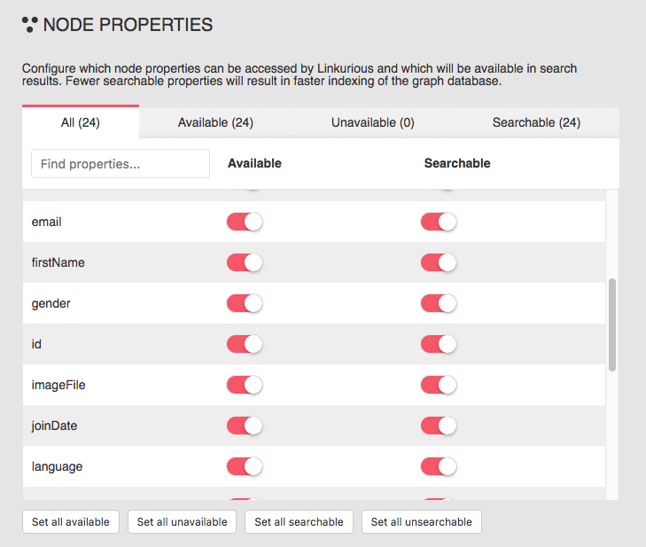

By default, all node and edge properties are available to users 
of {{lke}}. 
You can make some properties unavailable. 
Unavailable properties will no longer be accessible or searchable.

Open the *Admin* > *Data* menu, and scroll down to the Node 
properties section. 
All properties are marked as available in the following example.

