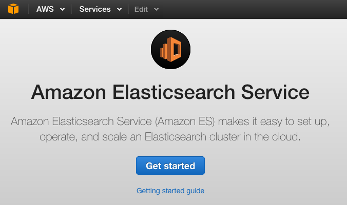
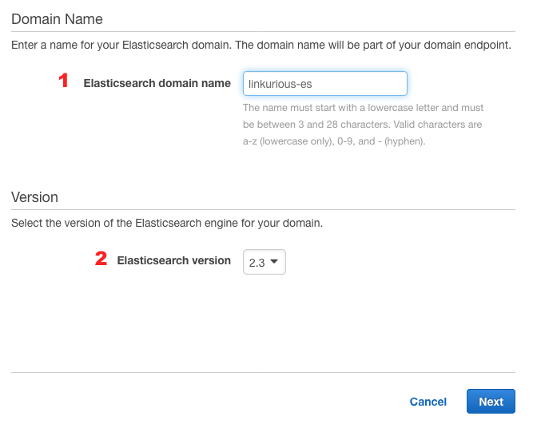
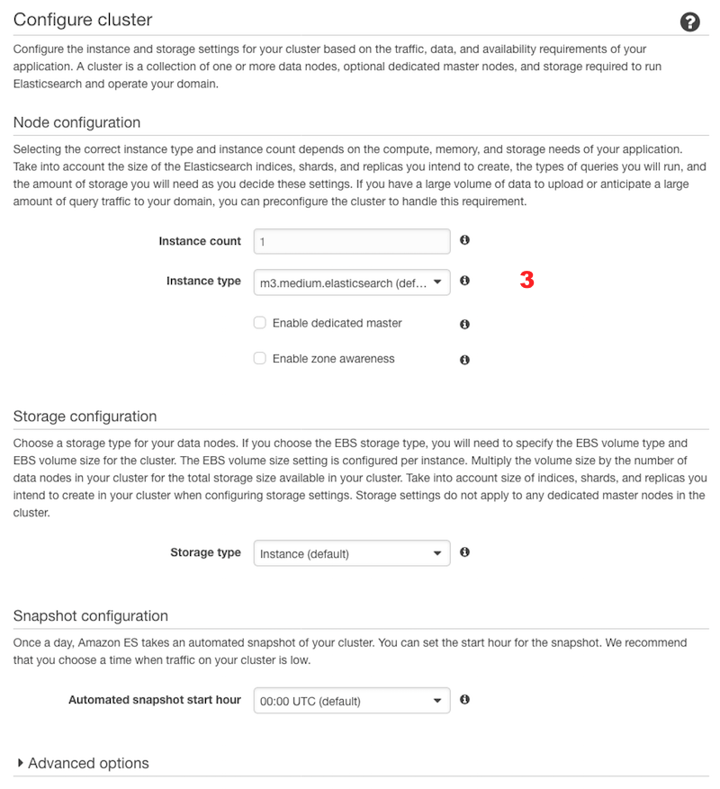
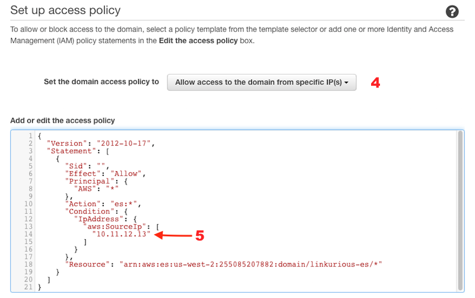
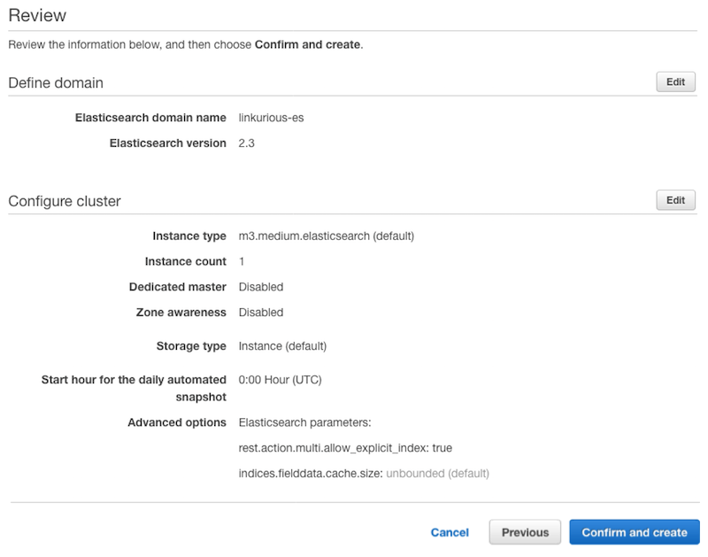
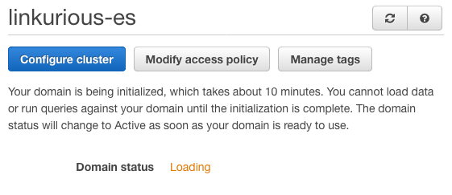
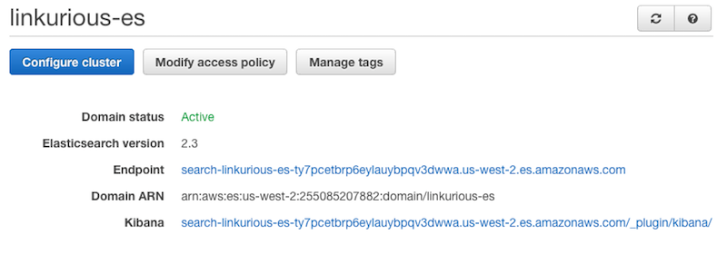

By default, Linkurious ships with an embedded {{es}} instance which works out-of-the-box by default.
The embedded {{es}} instance will work well for average to large database sizes, 
but for search-heavy use-cases or very large databases, 
configuring [your own Elasticsearch cluster](https://www.elastic.co/products/elasticsearch) might be necessary.

An easy way to deploy an easy-to-scale {{es}} cluster yourself is to use 
[Amazon Web Services](https://aws.amazon.com/) (AWS).

Please follow these steps to create a configure your AWS {{es}} cluster with Linkurious:

## Create your AWS account

Visit the [Amazon Web Services website](https://aws.amazon.com/) and create your account
(or log in if you already have one).

## Create a new cluster

Visit the [Amazon {{es}} Service page](https://aws.amazon.com/elasticsearch-service/), log-in and follow the steps to create an {{es}} cluster:

1. Select *Services* > *{{es}} Service*
   
   
2. Click *get started*
   

3. Name your cluster *(1)* and select the {{es}} version 2.x *(2)*, click *Next*
   
   
4. Select the instance type, the number of instances and the number of dedicated masters in your cluster *(3)*, depending on your database's size
   
   
5. Configure the access policy for your cluster. Use *access from specific IP* *(4)* and enter the public IP address of your Linkurious server *(5)*
   
   
6. Review your configuration and confirm the creation of the cluster
   
   
7. Wait until the cluster is deployed (usually less than an hour)
   
   
8. When your cluster is deployed, copy the *Endpoint* host name
   
   
9. Configure Elasticsearch as explained [here](/es-config/#configuring-elasticsearch-v2x)
