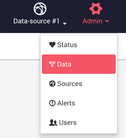
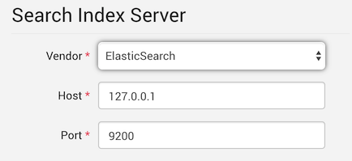

Linkurious allow you to search your graph using natural full-text search.

In order to offer the search feature out-of-the-box, Linkurious ships with an embedded
{{es}} server. This option allow for zero-configuration deployment in many cases.

## Indexing your graph data

By default, Linkurious uses {{es}} for search.
This options requires Linkurious to *index* your graph database,
which technically means that Linkurious will feed the whole content of the graph database
to {{es}} to make it searchable.
The time required to *index* the graph database increases with the size of the graph and this
solution has limits in its scalability.

Indexation typically happens at speeds between 2000 and 20000 nodes or edges per second,
depending on the number of properties for nodes and edges, and hardware performances.

## Embedded {{es}}

By default, Linkurious ships with an embedded {{es}} server (**version {{es.version}}**).
This server only listens for local connections on a non-default port (it binds to `127.0.0.1:9201`),
for security reasons and to avoid collisions with existing servers.

## Use your own {{es}}

It is possible to use your own {{es}} cluster for performances reasons.
Linkurious supports {{es}} v1.x and v2.x.
See [details about {{es}} configuration options](/es-config).

## Search scalability and alternatives to {{es}}

Using {{es}} is convenient but may not fit cases where
the graph database is big (more than a couple million nodes and edges) and is regularly
modified from outside Linkurious, which required to re-index the whole database.

In order to offer a scalable search feature on big graphs,
Linkurious offers alternatives search solution:

- With Neo4j: [using the neo4j-to-elasticsearch Neo4j plugin](/search-neo4j/#neo4j-to-elasticsearch-integration) to synchronize Neo4j and {{es}} incrementally
- With JanusGraph: [using Linkurious JanusGraph Search connector](/search-janus) to use JanusGraph built-in search indices
- With AllegroGraph: [using Linkurious AllegroGraph Search connector](/search-allegrograph) to use AllegroGraph built-in search indices
- With DataStax Enterprise Graph: [using Linkurious DSE Search connector](/search-dse) to use DSE built-in search indices
- With Stardog: [using Linkurious Stardog Search connector](/search-stardog) to use Stardog built-in search indices

## Edit the search configuration

### Using the Web user interface

The `index` configuration can be changed from the administration interface.

Using an administrator account, access the *Admin* > *Data* menu to edit the current data-source configuration:

Edit the data-source index configuration:

Submit the changes by hitting the *Save configuration* button

### Using the configuration file

Edit the configuration file located at {{config}}.

See details for each supported search connector:
- [{{es}}](/es-config)
- [Neo4j-to-Elasticsearch](/search-neo4j/#integrate-with-linkurious)
- [JanusGraph Search](/search-janus)
- [AllegroGraph Search](/search-allegrograph)
- [DSE Search](/search-dse)
- [Stardog Search](/search-stardog)
