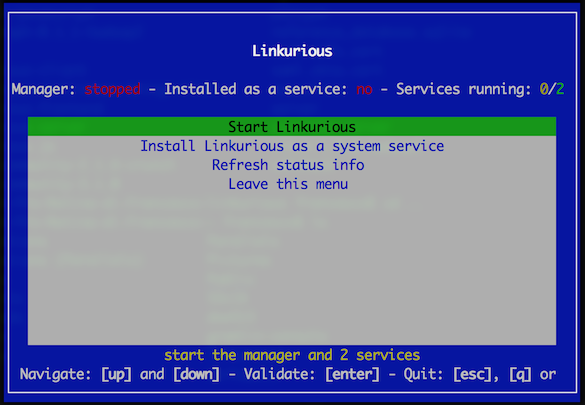

## Process monitoring

Linkurious starts 3 separate processes when launched:
- `node` (or `node.exe`): The internal process manager
- `node` (or `node.exe`): The Linkurious Server process
- `java` (or `java.exe`): The embedded [{{es}}]({{es.product.link}}) indexation server (if enabled).

Check if these processes are alive by opening the menu from the Linkurious directory 
(see how to open it on each operating system below):



### Linux systems

Run `menu.sh`. Alternately, run `menu.sh status`.

### Windows systems

Run `menu.bat`. Alternately, run `menu.bat status`.

### Mac OS X systems

Run `menu.sh.command`. Alternately, run `menu.sh.command status`.

## API status

The status of the API can be retrieved using a browser or a command line HTTP client like [cURL](https://curl.haxx.se/).

To retrieve the API status, send a `GET` request to http://127.0.0.1:3000/api/status
(replace `127.0.0.1` and `3000` with the actual host and port of your server).
```JS
// example response
{
  "status": {
    "code": 200,
    "name": "initialized",
    "message": "Linkurious ready to go :)",
    "uptime": 8633
  }
}
```

## API version

The version of the API can be retrieved using a browser or a command line HTTP client like [cURL](https://curl.haxx.se/).

To retrieve the API status, send a `GET` request to http://127.0.0.1:3000/api/version
(replace `127.0.0.1` and `3000` with the actual host and port of your server).
```JS
// example response
{
  "tag_name": "{{package.version}}",
  "name": "Brilliant Burrito",
  "prerelease": false,
  "enterprise": true
}
```
