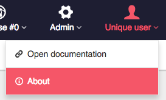
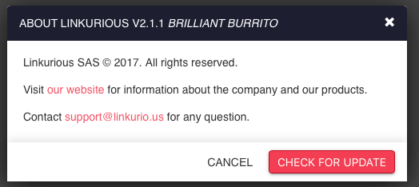

## About menu
Using an administrator account, access the *Your Username* > *About* menu to open the Linkurious info:



Click *Check for updates* to see if you are using the latest version.



## Public version API

Alternatively, you can check at http://linkurio.us/version/linkurious-enterprise.json
```JS
// example response
{
  "tag_name": "v{{package.version}}", // latest version of Linkurious
  "message": null,
  "url": "https://linkurio.us/my-account/" // where to download the latest version from
}
```
