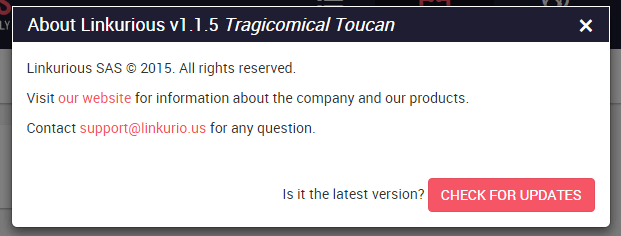

# Checking for updates

## About menu
Administrators can manually check if updates of Linkurious are available by opening the "about" menu from
 *Dashboard* > *account menu* > *about*.

Example "about" menu:


## Public version API

Another options is to open http://linkurio.us/version/linkurious-enterprise.json
```JS
// example output:
{
  "tag_name": "v{{package.version}}", // latest version of Linkurious
  "message": null,
  "url": "https://linkurio.us/my-account/" // where to download the latest version from
}
```
