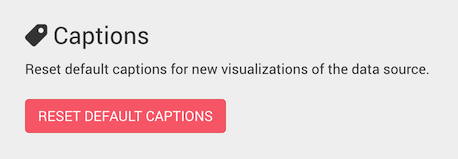

In Linkurious, node and edge captions are the texts display next to a node or an edge.

Captions can be configured individually by each user using the design menu,
but default values they can be configured for all users by an administrator.

To set default captions, you need to edit the `defaultCaptions` key in configuration file ({{config}}).
Inside `defaultCaptions`, the `defaultCaptions.nodes` and `defaultCaptions.edges` sections define the 
default captions for nodes and edges respectively.

Each of these two sections is an object where the keys must be *node categories* or *edge types* 
and values are objects with the following keys:

- `active`: Whether this caption definition is used
- `displayName`: Whether to prefix the caption text with the *node category* or *edge type* 
- `properties`: An array of properties keys that will be concatenated to create the captions.

**Example**:
```json
"defaultCaptions": {
  "nodes": {
    "CITY": {
      "active": true,
      "displayName": true,
      "properties": ["name"]
    "},"
    "COMPANY": {
      "active": true,
      "displayName": false,
      "properties": ["name", "country"]
    "}"
  "},"
  "edges": {
    "INVESTED_IN": {
      "active": true,
      "displayName": true,
      "properties": ["funded_month"]
    }
  }
}
```

Applying the previous example definition:

- A node with category `CITY` and `name: "Paris"` would have the caption `CITY - Paris`.
- A node with category `COMPANY`, `name: "Google"` and `country: "USA"` would have the caption `Google - USA`.
- An edge with type `INVESTED_IN` and `funded_month: "2016-04"` would have the caption `INVESTED_IN - 2016-04`.

## Applying default captions

Editing the default captions in the configuration file does not automatically change
captions for existing users.

Technically, the default captions configuration is only used when a user opens a
**new visualization for a given data-source for the first time**.
Existing visualizations are never affected by default captions changes in the configuration.

If you want to apply the default captions configuration to all
new visualizations created by all users for a given data-source, you need to:

1. Connect to Linkurious as an administrator
2. Select the data-source you want to apply the default styles to
3. Open the *Admin* > *Data* menu and scroll to the bottom of the page
4. Click the "Reset default captions styles" button.


