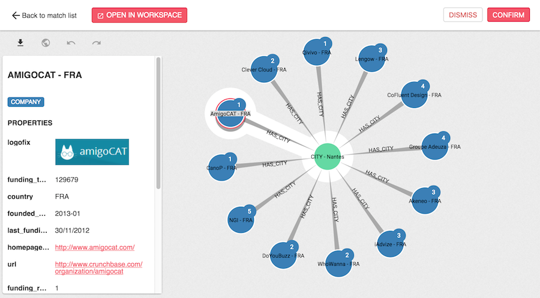

We visualize a match within a specific interface. 
On top of the visualization, you can :
* go back to the list of matches, 
* open the match in the workspace (to save it as a visualization, or edit nodes and edges),
* un/confirm or un/dismiss the match

Just below, you can download an image of the match, toggle the geo mode, and undo or redo your last action.

By clicking on a node or edge, you will open its property panel to see its type and properties.

Some features of the workspace are present to help you 
investigate, including expanding nodes or hide items. 

