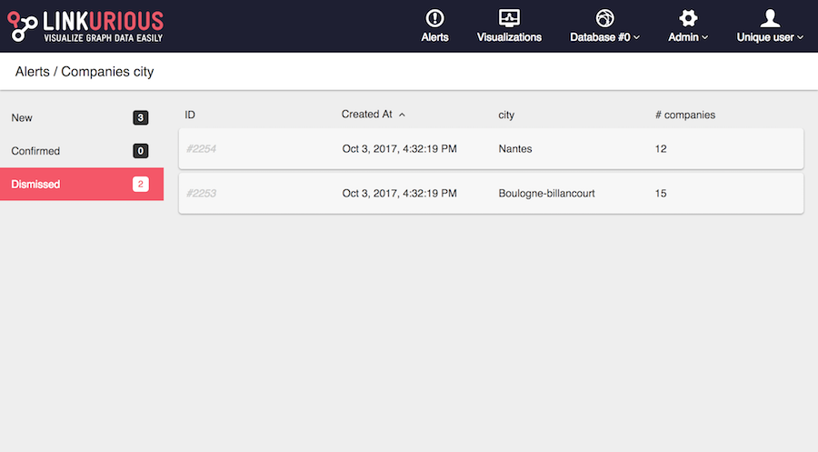

After double-clicking on an alert we get the list of newly detected matches. 
Matches are ordered by creation date. 
If the administrator has set up specific columns to this alert, we can sort matches by those columns.

Each row represents a match.

A match is either new, confirmed, or dismissed. 
On the left we can access the list of matches by status. 
For instance the following image shows the list of dismissed matches. 
We can see who has changed the status of those matches.

To take a decision, you must investigate on a match.
Simply click on a row to open the match visualization.
