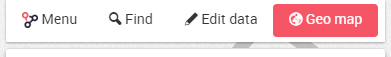
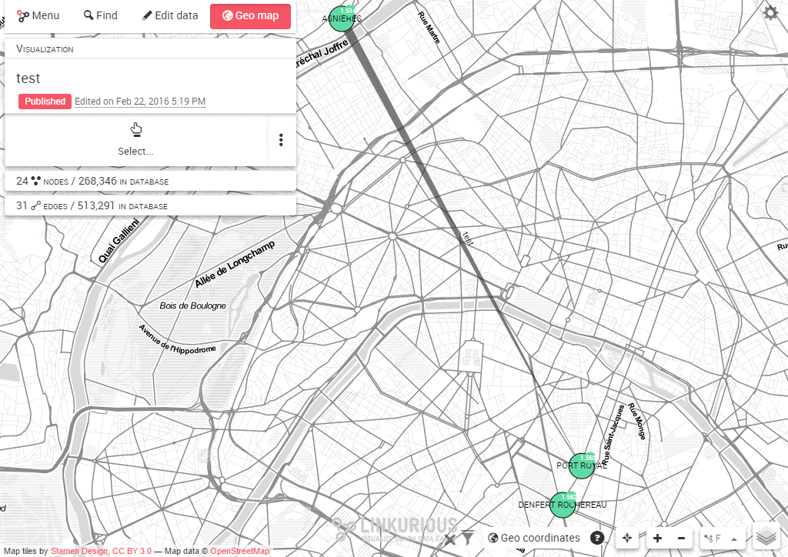
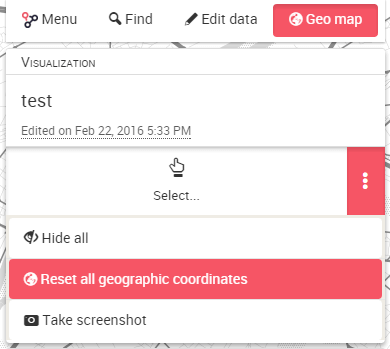
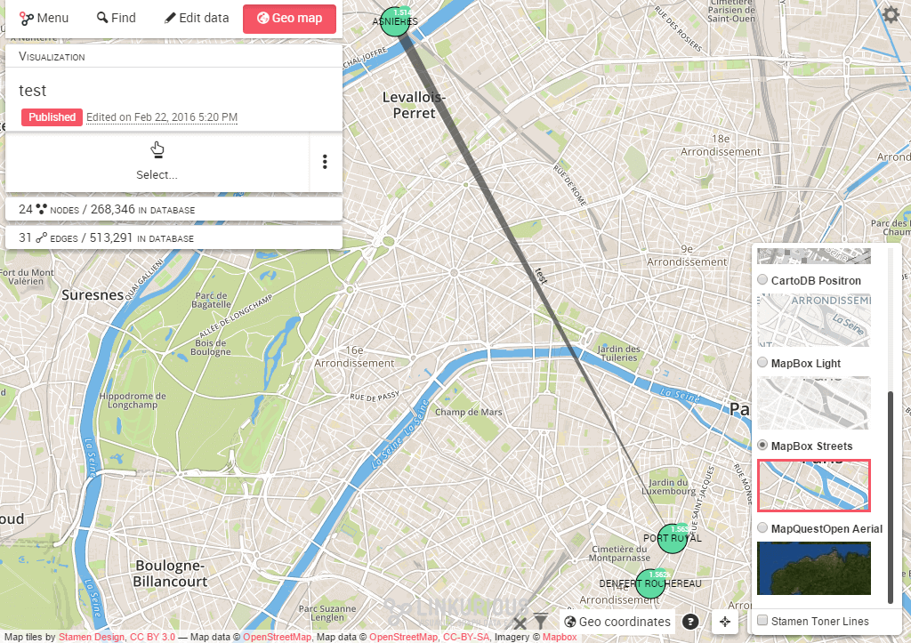
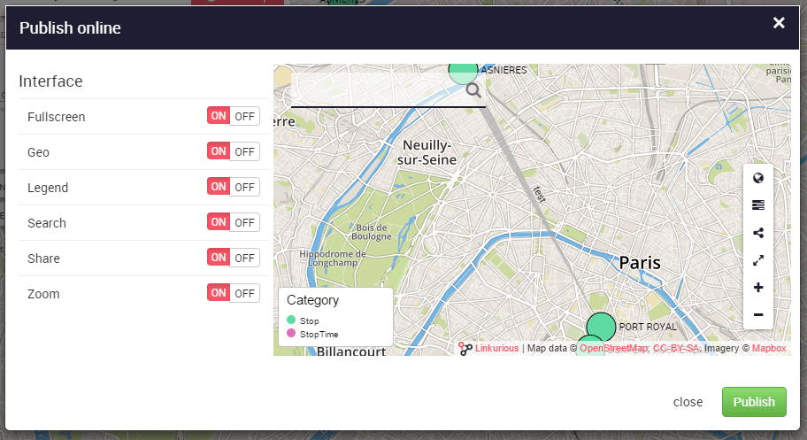

The *Geo mode* switch is available on the left panel of the Workspace. 
We can enable and disable the geo mode at will to switch between the
standard "network" view and the geographic view.

Click on it to display the geographical map.
Nodes are positioned on the map according to their geographic
coordinates.
Other nodes are hidden by the "geo coordinates" filter.

We can zoom in and out, drag nodes on the map to improve readability,
select nodes and edges, etc. We can always reset the node coordinates to
their original location via the actions menu:

Hover the layer icon  on the bottom-right of the
Workspace with your mouse.
The list of available layers is displayed.
We can pick another base-map and add overlays, depending on those
available on your instance of {{lke}} as seen below using the
[Mapbox](https://www.mapbox.com/) provider:

Finally, we can publish an interactive widget from
[**Workspace menu > Publish**](/visualization-publish) with the
geographical layers.

