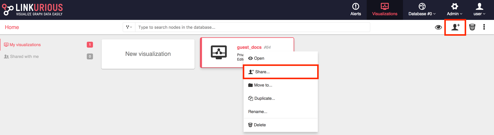

To enable the access of guest user to a especific visualization is necessary to share it publicaly.
If we right-click on a visualization or select the share option on top menu, we can share it as follows:

If the Administrator enabled the guest mode the toggle button is visible and can be clicked to share the select
visualization as public.

After shared, the url to open the visualization as guest can be copied by double clicking on the text box or clicking
on the copy button.

You can close the box, now your visualization it is publicly shared.