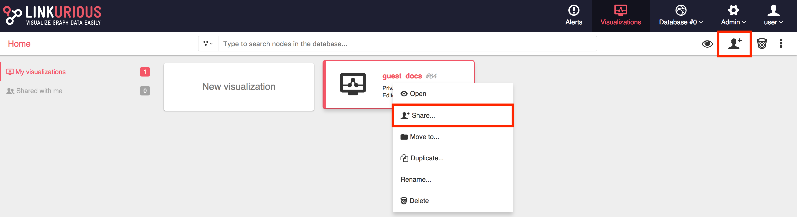
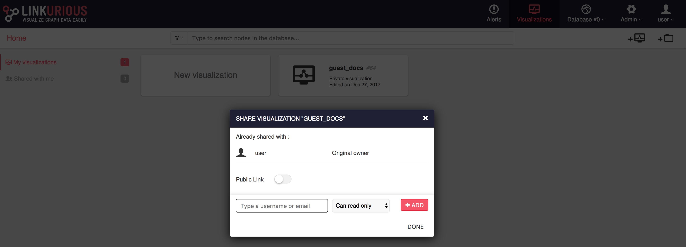
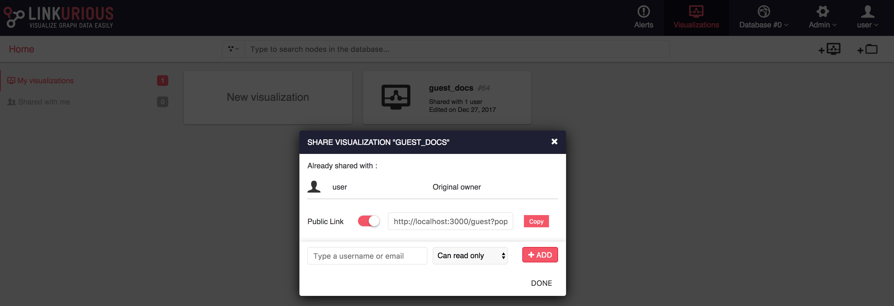

# What is the Guest mode
The Guest mode is a way to share graphs with people who do not have an account on Linkurious Enterprise.

Key characteristics:
- "Public link"-sharing: the Guest mode is very similar to the option found in Google Documents and many other applications. You get a URL that you can share as is or embed in an iframe in 3rd-party application.
- Read-only: the people you share a visualization with won't be able to modify the data in the database, and your visualizations will remain unchanged whatever they do in the Guest mode workspace
- Simplified interface.

The Guest mode is available once an Administrator has enabled it.

[TODO : add 2 images, one of a viz in LKE and one of the same viz opened through the Guest mode to illustrate the ]

# Share a visualization
There are 2 options to share a visualization with the Guest mode:
1. From the dashboard, right-click on a visualization and click Share
2. From the workspace of that visualization, go to Menu > Share this visualization

[TODO : add an image for sharing from the workspace]

- Enable Public link sharing for that visualization by clicking on the Public link toggle button.
- Copy the URL.
- Send the URL to whoever you want to share this visualization with.
- Clicking on the URL the person you sent it to will access a simplified workspace initialized with your visualization.

# Security warning
- People that you share a visualization with can explore beyond the data beyond the nodes and edges that are in your visualization.
- To get a better idea of what they are going to see:
  - Open another browser (for example open Firefox if you are currently using Chrome)
  - Make sure you are not logged in to Linkurious Enterprise in that browser. Log off is necessary.
  - Paste the URL
- If you feel there might be a security concern, please contact your Administrator.
