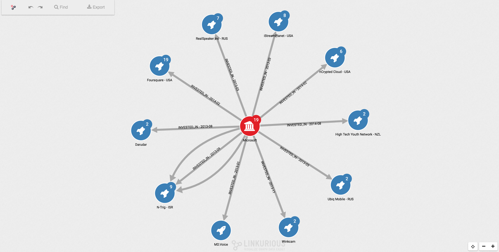

You can send the url copied before with any person you want to share your visualization. The options available to
the user depends of the preferences configurable by the Administrator.

Any change made on the visualization by the guest user is not reflected on the original visualization.
