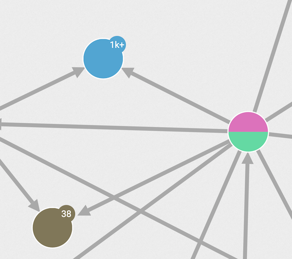

Expanding nodes means displaying the nodes that are connected to one
node or to a group of nodes.

We can expand nodes in different ways:

* double-click on a node in the view.
* select one or multiple nodes, then click on the `Expand` button of the
  left panel.
* right-click on a node in the view, then click on the `Expand` button of
  the tooltip.

The `Expand` button on the left panel displays the list of available
edge types and neighbor categories.
We can choose to get everything or to filter the retrieved edges
and neighbors.

If the expanded nodes have too many neighbors, it may however lead to
unreadable visualization.

{{lke}} prevents us from adding too many neighbors at once by asking
to filter the retrieved neighborhood.
A safeguard popup will appear, providing options to select a specific
edge type and neighbor category, to pick the most or least
connected neighbors, and to change the maximal number of retrieved
neighbors.
We may bypass this limit manually.

###Supernodes

When the number of neighbors is bigger than the supernodeThreshold
configurated by the Administrator (on the following example, 1000) the
node presents on the badge an approximate value of connections followed by
the plus signal.

Despite the behavior of a supernode be pretty similar to a node, it's not
permitted to use multi-expansion when at least one of the selected nodes is a supernode.

To prevent stay with an unreadable visualization every time one supernode
is expanded a safeguard popup will appear, providing options to select a specific
edge type, neighbor category and to change the maximal number of retrieved neighbors.

> It is tempting to always add more nodes and edges to your
visualization.
Beware though, if you are not careful you may end up with too many nodes
on your screen... and a worthless visualization.

> In order to avoid that, remember to always think twice before adding
more information to your visualization.
The filters and the hide functionality are here to help!
