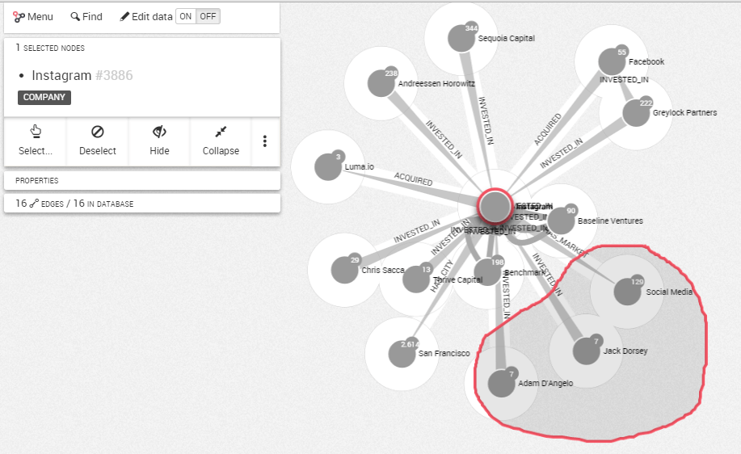
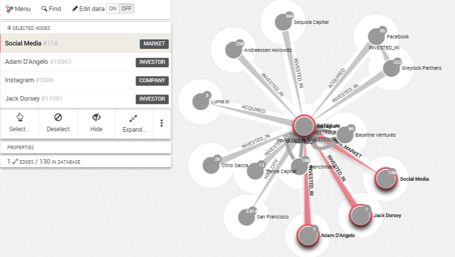

It is possible to select the nodes within a particular area of your 
visualization. 
For that, {{lke}} provides a lasso.

To do it, choose `Select` in the information panel on the left. 
Select `Toggle lasso`.
Move the lasso around the nodes you are interested in selecting to 
select them.

> You can also toggle lasso by simply clicking on the graph with the key `ctrl` or `cmd` (on MacOS) and move your mouse to create the lasso.

Release the mouse when you are finished and your selection is activated.

