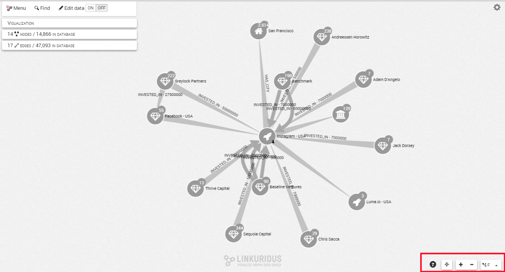
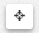
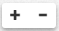
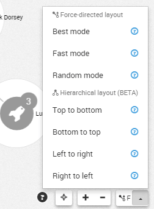
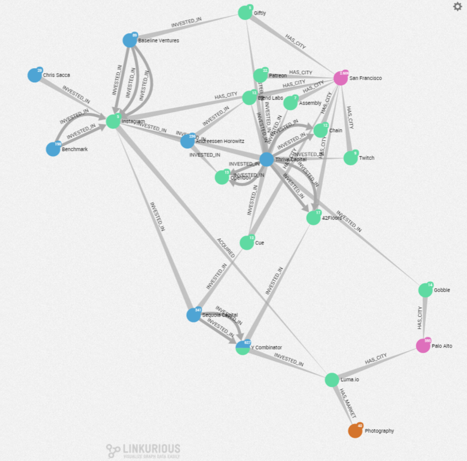
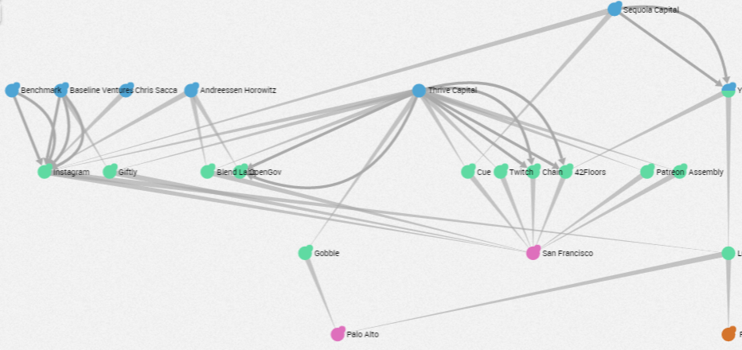
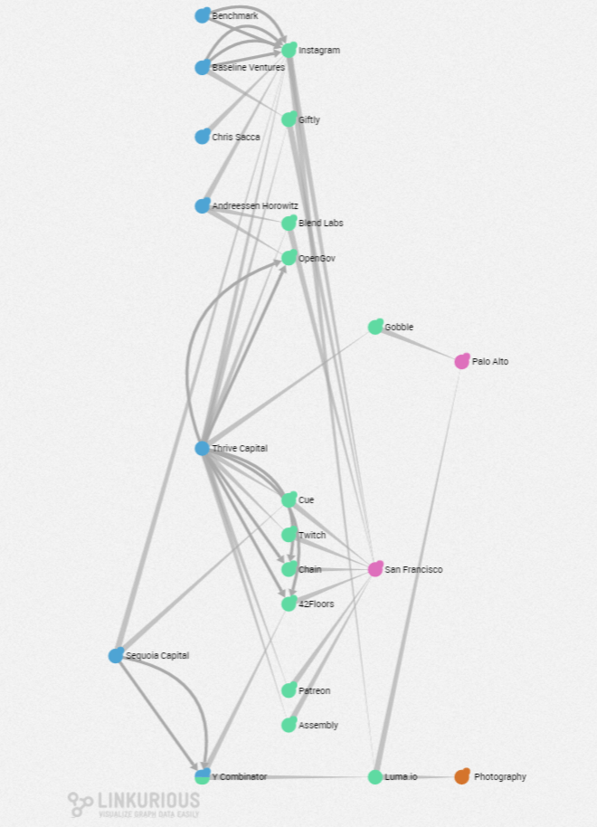
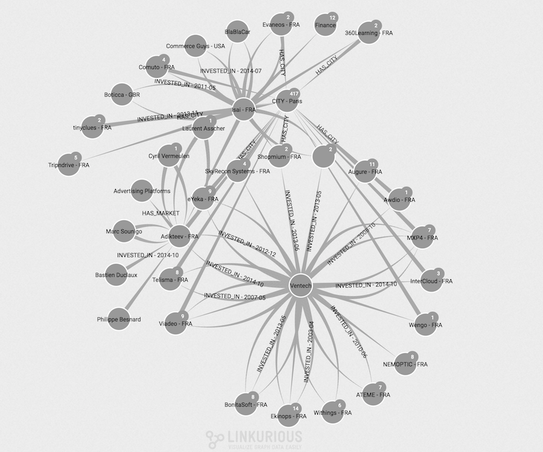
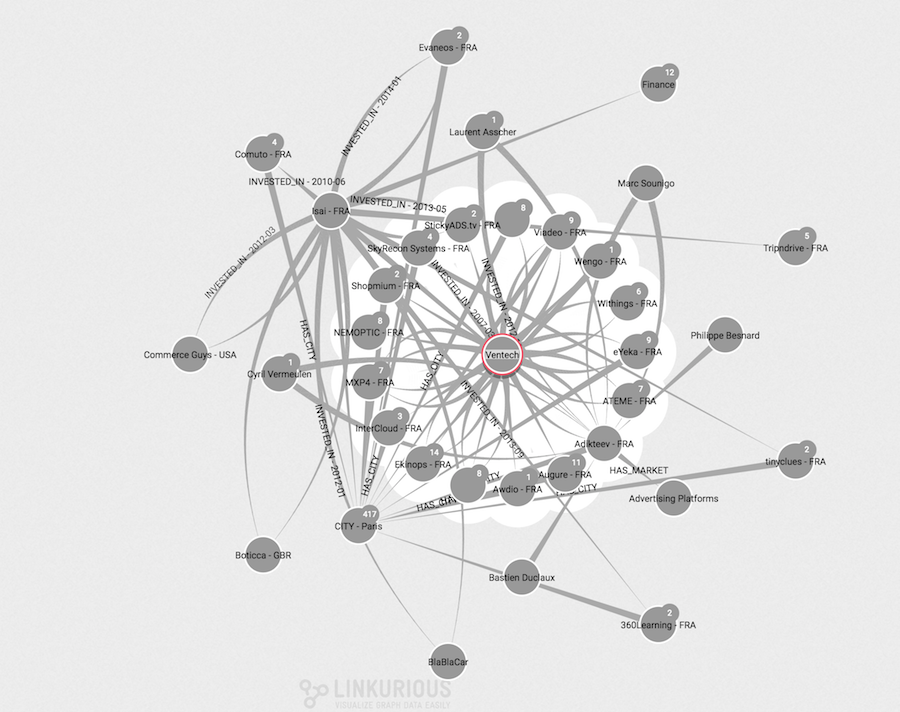

## Visualization controls

On the Workspace, various controls are available on the right-bottom of
the screen:

- The `Locate` button  centers the graph on the screen.
- The `Zoom In/Zoom Out` button  is to zoom in or zoom
  out on our graph.
- The `Layout` button give us various options to organize our graph.

A click on the layout button will apply the current layout, which is a
fast force-directed layout by default.
Three categories of layouts are available: force-directed, hierarchical and radial.
They come with pre-defined flavors:

## Force-directed layout

Such layouts position nodes according to their connections: connected
nodes are usually closed to each others, while disconnected nodes are
usually pushed further.

By enabling "incremantal expand" active, force-directed layouts will be 
applied only on new nodes added to the visualization.

**Best Mode:**
Takes the longest time to compute new node positions but provides better
results than the Fast Mode.

**Fast Mode (default):**
Quickly finds new node positions but some overlapping nodes may exist.

## Hierarchical layout

Such layouts organize nodes in different layers automatically by
aligning nodes of each layer either vertically or horizontally.
The root nodes are automatically found.

**Top to bottom Mode:**
Will position root nodes at the top of the screen.

**Left to Right Mode:**
Will position root nodes at the left side of the screen.

**Bottom to top Mode:**
Will position root nodes at the bottom of the screen.

**Right to left Mode:**
Will position root nodes at the right side of the screen.

## Radial layout

The Radial layouts positions nodes around the currently selected node (used as center of the layout) based on their 
graph-theoretical distance (shortest path in the graph).
This is useful to reveal layers in data and to draw the rest of the 
graph in its relation to the pre-defined focus node.

**Best mode:**
Will use an energy model to produce more readable layouts. It is also capable 
of handling special cases like disconnected components.

**Fast mode:**
Will use a geometrical model, which is faster but can produce more overlapping edges.

