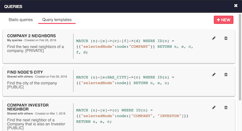
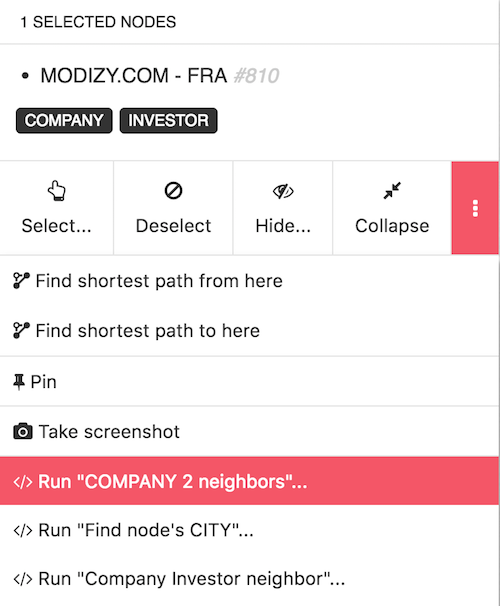
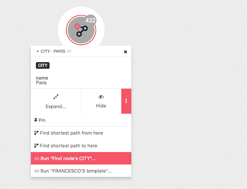

You sometime need to repeat a certain task in your visualization like 
expanding a certain type of nodes. You could also want to discover a 
specific path of connections from a node.

Template queries gives you the ability to run a pattern query on a 
specific context.

To view or create a template query, open the query list modal and click 
on the "Query templates" tab.

You will see all query templates created by you or share by others. You can
create as many query templates queries as you want and share them with 
other user of the dataSource.

You can run query templates by selecting a node in your visualization.

You can find the list of available query templates in the selection panel option menu.

You can also find it in the option menu of the node tooltip.

Just click on the query you want to run to add the result to the visualization.
