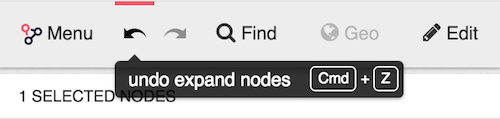
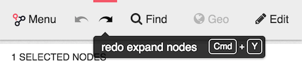

You now have the possibility to revert your last action on a visualization.

> You can revert only the last action you do on the visualization.

For example, after expanding a node, clicking the undo button 
(or using the shortcut `ctrl-z` or `cmd-z` on MacOS) will revert the expand by returning the graph to its previous state.

After reverting the expand, you can go back and re-run it by clicking on the redo button (or using the shortcut `ctrl-y` or `cmd-y` on MacOS).

You can undo all actions that impact your visualization except when you :

* Modify the captions
* Modify the styles
* Deleting a node (or edge)
