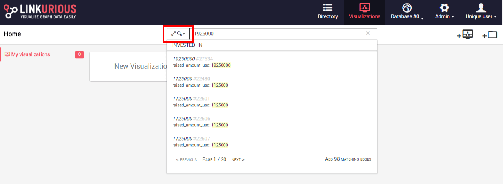
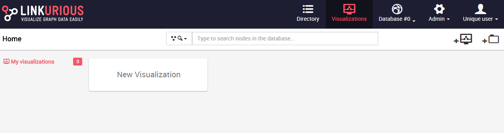
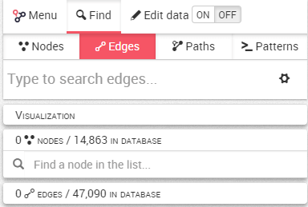
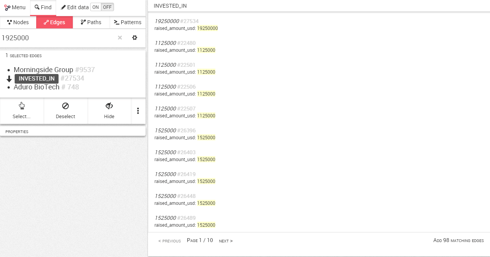
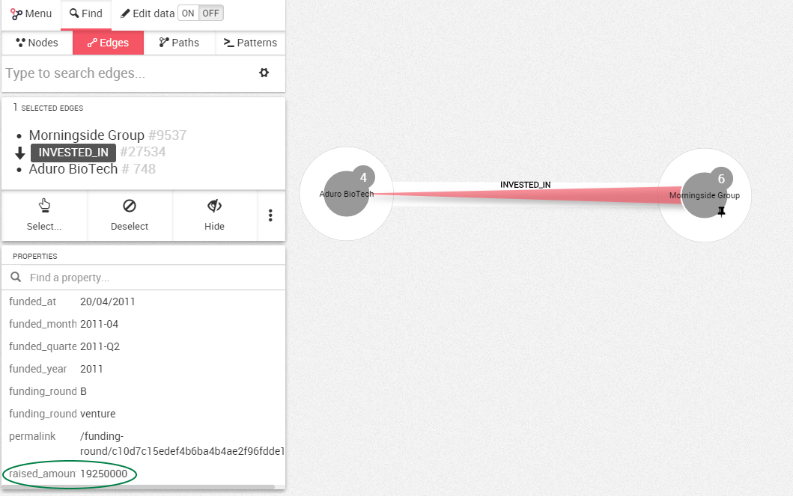

We may have millions of edges in our graph. What if we want to look at a
specific edge? 

The first possibility is to use the Quick Search bar available on the 
Dashboard, where we can either choose to look at nodes or edges (red box). 
Here we look at edges:

The second possibility is to use the search bar in the {{lke}} interface 
once we have created a New Visualization.

By default the finder opens on finding nodes. 
To search an edge, we click on the `Edges` tab.

The search for edges works exactly like the search for nodes.

We simply type what we are looking for. We see the list of suggestions 
that match our search.

In the search result, we can see that there is a edge that has the value 
`1925000` for the property `raised_amount_usd`.

We choose the result we are interested in by clicking on it. 
It is immediately added to the canvas where we can visualize it.

