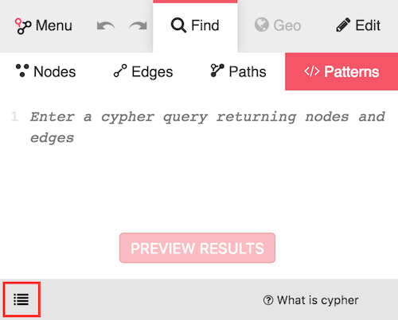
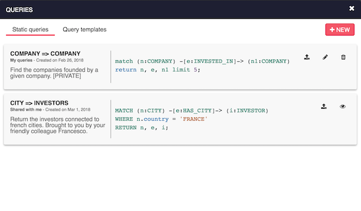

Most graph database support a query language that can be used to express 
pattern queries in the graph. Neo4j supports the ` Cypher` language, 
JanusGraph and DataStax Enterprise Graph support the `Gremlin` language and 
AllegroGraph and Stardog support the `SPARQL` language.

In {{lke}}, you can directly use these query language from the 
**"Find" > "Patterns"** menu. 
Once a query is previewed (using the *Preview* button), you can click 
the "Add all" button to add all matching results to the current 
visualization.

When clicking on the button "load queries", you can access to the list of 
queries saved by you or shared by other users.





In the queries modal, you can select a query to run, create, edit or delete existing queries.

## With Neo4j: the Cypher query language

The `Cypher` query language is similar to `SQL` and can be learned from 
[Neo4j's online documentation](http://neo4j.com/docs/developer-manual/current/cypher/).

Here is an example Cypher query that is using the Crunchbase dataset 
(see [our online demo](http://demo.linkurio.us)):
```
MATCH (city:CITY)<-[hasCity:HAS_CITY]-(company:COMPANY)
WITH count(company) as score, city, company, hasCity
RETURN city, company, hasCity, score
ORDER BY score DESC
LIMIT 25
```

This query will match all companies that are connected to a city in the 
database, count the number of companies in each city, sort the 
sub-graphs by city and return the 25 cities that have the most 
companies, with their companies. 

Note the Cypher query has to contain a `RETURN` statement and that all 
information that need to be displayed in {{lke}} must be included in 
the `RETURN` statement.
