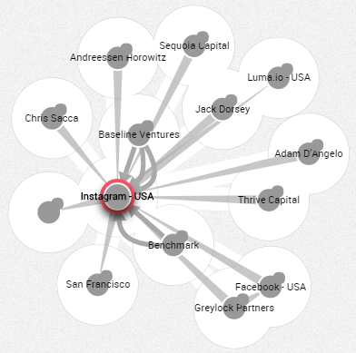

The default color of the nodes may be defined by the administrator of 
{{lke}}. 
Here the default color is grey.

When you select nodes and edges, they are immediately highlighted in 
red and a white halo appears on their connected nodes.

