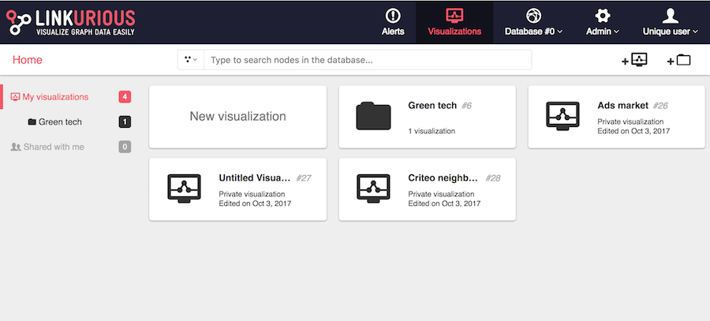
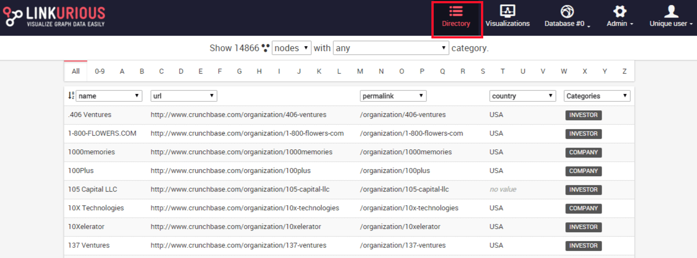
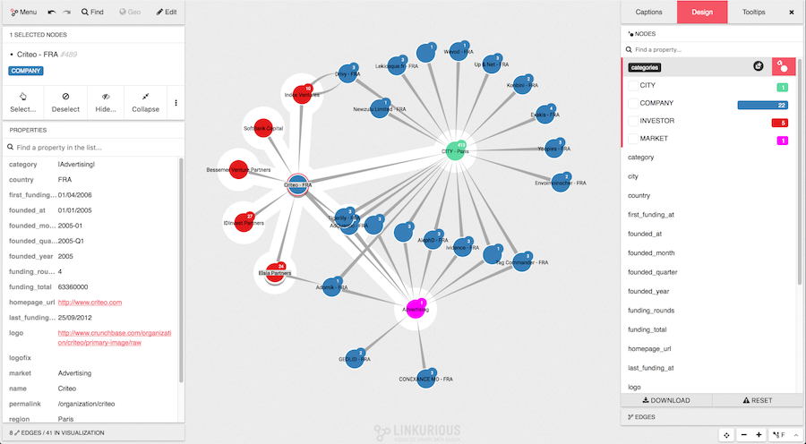

Here is a look at the interface of {{lke}}.

## Dashboard

The dashboard lists the visualizations created by the user. 
The following image shows a typical dashboard after starting to use 
{{lke}}.

## Directory

The directory lists all indexed nodes and edges of the graph database in 
a tabular display.

## Workspace

The workspace allows to explore the graph database and craft the 
visualization as a node-link diagram.

